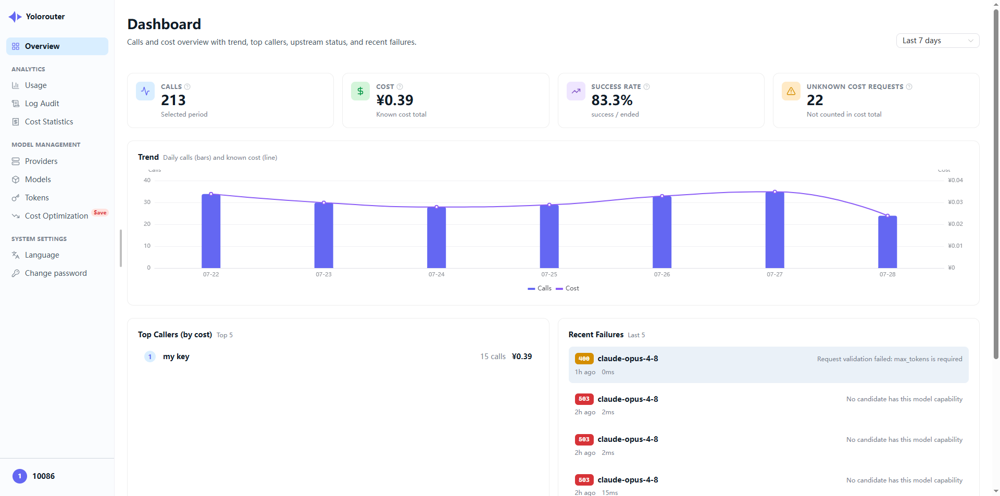
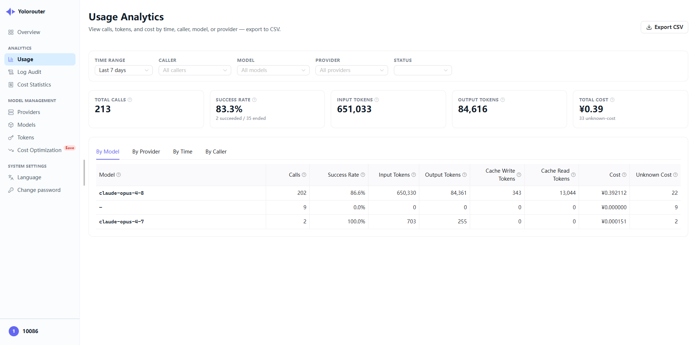

<div align="center">

# Yolorouter

**免费、自托管的 LLM 网关：同时支持四种协议入口、多供应商 failover、上游 Key 自动切换，管理后台内嵌于单个二进制。**

[](LICENSE)
[](https://github.com/yolorouter/yolorouter/actions/workflows/ci.yml)
[](https://goreportcard.com/report/github.com/yolorouter/yolorouter)
[](https://github.com/yolorouter/yolorouter/releases)
[](go.mod)

[English](README.md) · 简体中文

[快速开始](#快速开始) · [协议](#协议) · [成本优化](#成本优化) · [文档](#文档) · [贡献](#贡献)

⚡ **低开销流式代理** · 🔀 **任意协议进、任意协议出** · 🆓 **免费开源** · 📦 **单二进制 · 零外部依赖** · 🔁 **自动 failover + Key 轮换** · 💰 **成本分析与优化**

</div>

---

把你的应用指向**一个**端点、**一个** API Key。Yolorouter 站在你的应用和上游供应商之间，
把那些麻烦事——管理多个供应商账号、轮换被限流的 Key、账号出问题时自动切换、按 Key
控制预算、搞清楚每一笔花了多少钱——都收在一个地方，而不是散落在每个代码库里。

它接受**四种协议**入口：OpenAI Chat Completions、OpenAI Responses、Anthropic Messages
和 Gemini `generateContent`，并且可以在转发时把其中任意一种翻译成另一种。只会 OpenAI
的供应商可以给 Claude Code 供能；只会 Anthropic 的供应商可以服务 OpenAI SDK。流式、
工具调用、推理/思考块都能完整穿过这层翻译；图片内容除 Responses 入口外也都支持
（见[协议](#协议)）。

所有东西都在**一个二进制**里，管理后台已内嵌。不需要 Node 运行时，不需要单独部署前端，
不依赖任何外部服务——SQLite 开箱即用，需要时可换 PostgreSQL。

## 为什么用 Yolorouter

**路由**

- **多供应商 failover** —— 把一个对外模型名（如 `smart`）映射到有序的供应商候选列表。某个不可用时自动切到下一个，调用方全程只看到同一个对外模型名。
- **上游 Key 自动切换** —— 每个供应商配一个 Key 池。限流、认证失败、额度不可用的 Key 会被自动跳过。
- **模型别名** —— 调用方用稳定的对外名；每个供应商候选把它映射到该供应商实际接受的模型 id。保存候选映射时会真实探测一次上游，配错的模型名在配置阶段就暴露，而不是等到半夜出故障。
- **流式做对了** —— Key 切换与 failover 都发生在首字节抵达客户端**之前**；一旦开始流式，供应商即被锁定，绝不把两个供应商的内容拼进同一个响应。
- **为推理模型调过的超时** —— 七个互相独立、可配置的阶段，而不是一刀切的总超时，所以"想了八分钟才吐第一个 token"的模型不会被中途掐断。

**管控与成本**

- **按 Key 访问控制** —— 模型白名单、速率与并发限制、累计预算上限、可选过期时间，支持即时吊销。
- **成本优化** —— 可全局或按 Key 注入自定义系统提示词；把体积大的工具输出在发往上游前压缩。后台会显示每项功能实际省下了多少。
- **内置可观测性** —— token / 成本 KPI 仪表盘，按模型 / 供应商 / 时间 / 使用人的用量与成本分析，以及含完整逐次尝试路由链的请求日志。任意视图可导出 CSV。
- **双语后台** —— 简体中文与 English，登录前后随处可切；时区跟随浏览器。
- **自更新** —— 二进制可检查并应用新版本。

## 截图

<div align="center">
  
  
</div>

## 快速开始

把 yolorouter 安装成开机自启的后台服务——Linux 用 systemd，macOS 用 launchd，
Windows 用计划任务：

```bash
# Linux / macOS
curl -fsSL https://get.yolorouter.com/install.sh | bash
```

```powershell
# Windows，PowerShell 5.1+
irm https://get.yolorouter.com/install.ps1 | iex
```

Windows 上，用管理员身份运行 PowerShell 会装成开机自启的系统级服务；用普通权限运行则装
在当前用户下，登录时自启。

> **🇨🇳 国内加速安装**：如果你在国内、直连 GitHub 慢或不通，把 `get.yolorouter.com`
> 换成 `gh.yolorouter.com` —— 同一个安装器，经 Cloudflare 代理下载，装完后的自动升级
> 也会一直走加速通道，无需额外配置。

重跑同一条命令即可升级，配置和数据库原样保留，升级前会先自动备份数据库。想直接跑二进制？
从[发布页](https://github.com/yolorouter/yolorouter/releases)下载后执行 `./yolorouter serve`
（Windows 上是 `.\yolorouter.exe serve`）。

首次运行会生成 `configs/config.yaml`、执行数据库迁移，并在 8080 端口启动后台。创建首个
管理员账号后按引导操作：添加供应商和上游 Key，创建模型及其供应商候选，然后签发 API Key。

→ **完整安装说明（全平台，含从源码构建）：**
[yolorouter.com/help?p=self-hosted/installation](https://yolorouter.com/help?p=self-hosted/installation&utm_source=oss-readme&utm_medium=repo)

## 协议

下面每个入口都用**同一个** Yolorouter API Key 认证、都支持流式，并且都可以由**任意**
已配置的供应商来承接——不管那个供应商原生说哪种协议。

| 入口路由 | 协议 | 可用的认证头 |
| --- | --- | --- |
| `POST /v1/chat/completions` | OpenAI Chat Completions | `Authorization: Bearer`、`X-Api-Key` |
| `POST /v1/responses` | OpenAI Responses | `Authorization: Bearer`、`X-Api-Key` |
| `POST /v1/messages` | Anthropic Messages | `Authorization: Bearer`、`X-Api-Key` |
| `POST /v1beta/models/{model}:generateContent`<br>`POST /v1beta/models/{model}:streamGenerateContent` | Gemini | `x-goog-api-key`、`?key=`、`Authorization: Bearer`、`X-Api-Key` |
| `GET /v1/models`、`GET /v1/models/{model}` | 模型发现 | `Authorization: Bearer`、`X-Api-Key` |

请求里的 `model` 是你在后台配置的**对外名**。Yolorouter 会挑选供应商候选、替换成真实的
上游模型 id，并在返回时保持你的对外名不变。

> **已知限制**：Responses 入口的 `input_image` 条目，在请求需要翻译成另一种出口协议时
> 会被丢弃，只有文本被传递。同协议透传不受影响，另外三个入口的图片内容翻译正常。

### 让现有 SDK 和工具直接指过来

因为入口就是真正的原生协议，官方 SDK 和 agent 工具只需改两个设置即可接入，不需要任何
适配层。

```python
# OpenAI Python SDK
from openai import OpenAI

client = OpenAI(base_url="http://localhost:8080/v1", api_key="sk-yr-your-key")
print(client.chat.completions.create(
    model="smart",
    messages=[{"role": "user", "content": "你好！"}],
).choices[0].message.content)
```

```bash
# Claude Code——经 Yolorouter 转发到你配置的任意供应商
export ANTHROPIC_BASE_URL=http://localhost:8080
export ANTHROPIC_AUTH_TOKEN=sk-yr-your-key
claude
```

→ **各协议的完整请求示例，以及 19 个 agent 工具的接入指南**
（Claude Code、Cursor、Codex CLI、Cherry Studio、Gemini CLI、opencode……）：
[yolorouter.com/help](https://yolorouter.com/help?utm_source=oss-readme&utm_medium=repo)

## 成本优化

两项功能默认关闭，在后台全局设置，并且可以按 API Key 单独覆盖。

**自定义系统提示词注入。** 不改客户端代码，就能给每个请求的系统提示追加统一规则。注入
按调用方自己的协议形态追加，并且是确定性的，因此多次请求得到的系统内容字节一致，仍然能
命中上游的 prompt 缓存。

**输入压缩。** 编码类 agent 会回传大量高度冗余的工具输出。Yolorouter 会识别请求中每个
内容块的类型——`go test` 输出、git diff、grep 结果、普通日志——只去掉噪声、保留信号：
失败、堆栈、每一条不同的匹配都会保留。压缩不会碰对话尾部的活跃编辑区，并且只有压完确实
更短时才替换。

缓存读 / 缓存写 token 在仪表盘、分析和成本页里全程单独计量和计价，所以 prompt 缓存省下
多少是一个能看到的数字，不是感觉。

→ **细节与调优：**
[yolorouter.com/help?p=self-hosted/configuration](https://yolorouter.com/help?p=self-hosted/configuration&utm_source=oss-readme&utm_medium=repo)

## 文档

| 主题 | 链接 |
| --- | --- |
| 安装（全平台、从源码构建） | [安装](https://yolorouter.com/help?p=self-hosted/installation&utm_source=oss-readme&utm_medium=repo) |
| `config.yaml` 全字段与 CLI | [配置](https://yolorouter.com/help?p=self-hosted/configuration&utm_source=oss-readme&utm_medium=repo) |
| 升级、回滚、卸载 | [升级与卸载](https://yolorouter.com/help?p=self-hosted/updating&utm_source=oss-readme&utm_medium=repo) |
| 分层结构、协议 IR、存储 | [架构](https://yolorouter.com/help?p=self-hosted/architecture&utm_source=oss-readme&utm_medium=repo) |
| API 参考与模型列表 | [文档首页](https://yolorouter.com/help?utm_source=oss-readme&utm_medium=repo) |

自托管需要你自己准备各家上游供应商的 API Key。如果你不想一家家去注册和充值，
**YoloRouter Cloud** 已经在后台的预置供应商列表里，可以作为其中一个上游选中使用——
详见[托管版](https://yolorouter.com/pricing?utm_source=oss-readme&utm_medium=repo)。

## 从源码构建

依赖：**Go 1.25.7+** 与 **Node.js 22.12+**。

```bash
make build          # 仅后端 -> ./bin/yolorouter
make build-embed    # 内嵌后台的完整二进制
```

交叉编译目标、测试命令与本地开发流程见 [CONTRIBUTING.md](CONTRIBUTING.md#building-and-testing)。

## 贡献

欢迎提 Issue 和 PR。请先阅读 [CONTRIBUTING.md](CONTRIBUTING.md) 与
[行为准则](CODE_OF_CONDUCT.md)。报告安全问题见 [SECURITY.md](SECURITY.md)。

## 许可证

基于 [Apache License 2.0](LICENSE) 授权。
